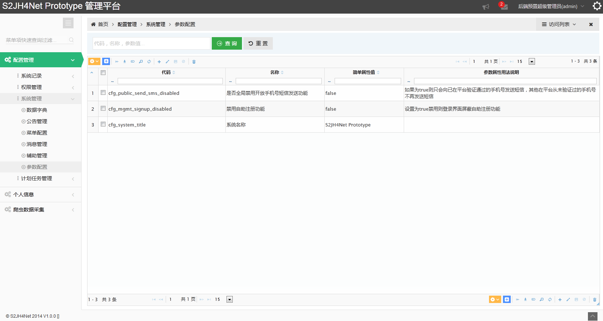

## Outline

When performing basic framework features designed for ease of understanding and versatility, as far as possible in the most simplified model design and implementation, as part of the authority did not introduce user groups, departments, roles, inheritance concept; announcement does not introduce the concept of a group or private letters and other messages and therefore may not be able to meet the complex business needs of practicality above, please reference the extended design and implementation.

Since the code is constantly updated iteration, each functional screenshot may differ from the actual operating results, are for reference only. Please actual function to run effects prevail.

### Login management background

To simplify the user logs on, only the default account number and password, if a certain number of input errors, automatically forces enter verification code to prevent malicious guessing tool to crack account passwords.

! [Login] (images / function-login.png)

! [Login failed] (images / function-login-failure.png)

### Retrieve Password

In the login screen, click on "Forgot your password" link, or by registered mail account, send a self-service password to retrieve e-mail, after authentication by setting a new password reset.

! [Forgot your password] (images / function-forget-password.png)

### Self-service registration

In the login screen , click on the " self-registration " link and fill out the registration information submitted to the administrator audit background and set permissions configuration, simplified registration management accounts.

Can be turned on or disable the self-registration feature by setting cfg \ _mgmt \ _signup \ _disabled parameters.

! [ Self register ] (images / function-signup.png)

### Configuration Management: Rights Management : Rights Management

Data automatically generated list of system privileges based @RequiresPermissions comment code, without manual maintenance.

! [Function-privilege] (images / function-privilege.png)

### Configuration Management: Rights Management : Role Management

Basic information management roles and associated permissions configuration.

! [Function-role] (images / function-role-list.png)

! [Function-role] (images / function-role-privileges.png)

### Configuration Management: Rights Management : User Management

Basic user account information , association roles configuration management , and provide authority, computing summary information View menu .

! [Function-user] (images / function-user-list.png)

! [Function-user] (images / function-user-roles.png)

! [Function-user] (images / function-user-privileges.png)

! [Function-user] (images / function-user-menus.png)

### Configuration Management: Rights Management : Registered User Management

Through the administration login screen self-service registration account review and initial permissions configuration management.

! [Function-user] (images / function-signupuser-list.png)

! [Function-user] (images / function-signupuser-audit.png)

### Configuration Management: Rights Management : Department Manager

An extremely streamlined object definitions and sectoral management , the level of the current framework basically no practical use. It can be used as a basis for the definition of the tree structure and data management capabilities to achieve reference . And on the existing basis in accordance with the actual business needs to improve object definition and management capabilities .

! [Function-department] (images / function-department.png)

### Configuration Management: System Administration : Menu Manager

@MenuData Annotation based framework automatically generates menu data base , generally on the basis of management by menu function to adjust the relative ranking of No. maintain what order to display the control menu .

! [Function-menu] (images / function-menu.png)

### Configuration Management: System Administration : Configuration parameters

System management configuration parameters , and extends the Spring Framework attribute data loading, in addition to load the properties from .properties files also automatically loaded from the data sheet covering property values ​​specific reference DynamicConfigService;

### Configuration Management: System Administration : Data Dictionary

Commonly used in the drop-down box and other types of key-value data configuration :

! [Function-data-dict] (images / function-data-dict.png)

### Configuration Management: System Administration : Management Bulletin

Management and maintenance of the entire system user -level announcement information, view reading record . Reference aurora push mainstream APP push model , set the definition of the relevant notification packet control parameters .

! [Function-notify-message] (images / function-notify-message.png)

! [Function-notify-message] (images / function-notify-message-edit.png)

### Configuration Management: System Administration : Messaging Management

Access to the system generated by the business logic , the list of messages and read the record information sent to individuals.

! [Function-user-message] (images / function-user-message.png)

### Configuration Management: System Management: assistant management

In order to effectively carry out the development, testing , operation and management process , the framework provides a range of support management functions , specific functions using the detailed functional description .

! [Function-util] (images / function-util.png)

### Configuration Management: The system records : Exception Logging

Based Logback of DBAppender the system Exception records to the database, providing front-end UI convenient and intuitive to view the error logs and processing records .

! [Function-error-log] (images / function-error-log.png)

! [Function-error-log] (images / function-error-log-detail.png)

### Configuration Management: The system records : Account Records

Record and view user login , logout and other information.

! [Function-logon-log] (images / function-logon-log.png)

### Configuration Management : The system records : send message record

Text messages sent to the user , e-mail , and other water interface call record information .

! [Function-send-log] (images / function-send-log.png)

### Configuration Management: The system records : operational record

Based on Spring MVC AOP interceptors , the POST request additional data and information to the user login operation Envers audit object properties , modify the data flow record .

! [Function-rev-log] (images / function-rev-log.png)

### Configuration Management: The system records: Data Change History

Envers audit records based on the object to provide business-specific data objects, change the properties of advanced queries, and provides a comparison of the data displayed.

! [Function-rev-log] (images / function-rev-log2.png)

! [Function-rev-log] (images / function-rev-compare.png)

### Configuration Manager: Planning Task Management

Provide configuration time-based Quartz timing control task execution management, task execution history and other management functions.

! [Schedule] (images / schedule-cfg.png)

! [Schedule] (images / schedule-mgmt.png)

! [Schedule] (images / schedule-hist-list.png)

### Personal information

Announcement Message relates to the login associated with the user, see a list of personal messages, personal profile information.

! [Profile] (images / function-profile-notify-message.png)

! [Profile] (images / function-profile-user-message.png)

! [Profile] (images / function-profile.png)

### Reptiles data collection

MongoDB based storage, achieve a reference Nutch with administrative capabilities lightweight crawler data acquisition analysis module, and provides more than N reference sample and unit testing; logback achieve real-time log rolling in the UI-based client and server Netty HTML5 EventSource display.

See section: [reptile Data Acquisition] (reptiles data acquisition .md)