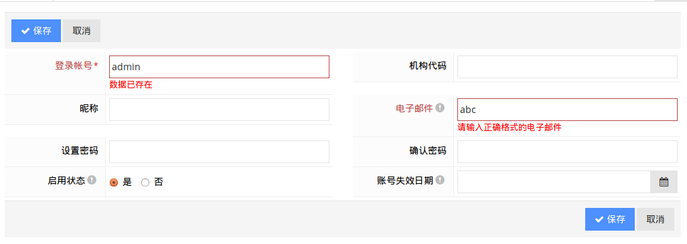

## Outline

UI component part of the design is mainly based on JQuery / Bootstrap and related plug-ins , on the basis of standard Struts2 tag to make use of the standard in order to bootstrap the popular DATA API style , add custom components to define the framework and extensions. If you can solve the problem as much as possible front-end JS to JS extension into ways, of course, add a small amount of a few Struts2 extension Tag to use in OGNL syntax.

## Major UI components Introductory description

The following description of the main components of the framework extension of some of the properties will be described , the plug-in itself relevant standard attributes and usage please refer to the official documentation of the corresponding components or online usage information . Document aims to guide the development of preliminary , unless no longer necessary for each component theme , it is recommended to run the application directly to the actual experience of the various UI components effect. Only a brief description of the document extended attributes , you can understand the details of the specific use of property by searching JS and JSP files.


### Global Properties

** WEB_ROOT **: the current Web application ContextPath of JS variables JS code is generally used in the assembly URL

** Note that the following examples or document links need access to effective online presentations or local deployment runtime ! **

### <a Href="../../../../admin/#/docs/ui-feature/items|UI组件用法示例" target="_blank"> UI component usage examples </ a >

Typical UI components to provide a basic reference schematic usage , combined with the corresponding documentation for JSDoc functional attributes associated UI component usage and support .

### <a Href="../../../../docs/jsdoc/index.html" target="_blank"> Javascript comment JSDoc documentation </a>

Based on the framework of the main Javascript code file comments, use reference document with the jsdoc3-maven-plugin generated UI components.

Points ## design ideas


About ### Processing Form / Data Validation of

Based front-end server interaction Javascript form validation and Java-based server-side validation logic should be said is very important to check the tip can effectively enhance the user-friendliness UI interactions, and reduce unnecessary data validation purposes; service side validation is the evaluation of a system of security, robustness, an important part, because Web applications for its ease of access and also determines its users vulnerable to malicious attacks need only be familiar with the principles and basic HTTP request tool, you can easily bypass the front-end data validation for server-initiated illegal data requests directly.

For front-end, it has a more mature Javascript / JQuery form validation plug-in, as in the present framework chosen JQuery Validation. For server-side validation, Struts level, there Struts Validator, but the overall feeling is very complicated; and now popular (http://jcp.org/en/ [[link] (images / link.gif) JSR303 Bean Validation!] jsr / detail? id = 303) to move data check more granular business layer and the physical layer, as in the present framework chosen Hibernate Validator.


Former label also take into account the special circumstances and to provide extended attribute validator for automated processing surfaces cover the label when it comes to the front and rear side validation is very important, but often feel the presence of both annoying impedance front-end validation logic components in the relevant JS it is defined in the server-side validation logic associated XML file or Java code annotation formal definition, which can easily lead to a problem, and sometimes changed the front end verification logic forgot to change back-end logic, and vice versa.

Since the introduction of the framework Grid Inline editing mode and Form Form Editor exist, we put forward a demand for additional: How can simplify and better maintained Grid Inline Edit Interface / Form Edit interface and Java Validator consistency. Therefore, using the framework to initiate an additional AJAX JSON request (based on the current Entity defined by the Java reflection mechanism, try depending on the type of property, JSR303 Validator annotations, annotations and Hibernate Entity automatically combined to generate JSON response structure validation rules, specific implementations may refer to: PersistableController the buildValidateRules method) to get into the server validation rules to Grid Inline validation Form validation and dynamically add parity. In effect such a treatment can basically be calm Fu Jiucheng more common form validation needs, of course, try to set aside at the entrance to the custom validation rules.

The default frame automatically according to the rules provided check process on Grid Inline Edit and Form Edit, by adding to the Grid editrulesurl: false or add data-editrulesurl = "false" attribute to form element to close the automated verification process .

Automatic processing validation framework include the following :

* Based Entity attribute type defined above , JSR303 Validator annotations , Hibernate Entity annotation automatically add digital form element / is not empty / length limit / format / field and a series of unique data verification ;

* Nullable = false definition based on Entity definition automatically add a red asterisk labeled form elements label;

* Based on Meta annotation using Entity Framework custom tooltip automatically generates a prompt message tag to the corresponding form element label area ;
 
 Example:
    
```Java
    @MetaData(value = "E-mail", tooltips = "can be used to retrieve the password self-service user receives notification system")
    private String email;
    
    @Email
    @Column(length = 128)
    public String getEmail() {
        return email;
    }
    
    @Size(min = 3, max = 30)
    @Column(length = 128, unique = true, nullable = false, updatable = false, name = "user_id")
    public String getSigninid() {
        return signinid;
    }
```
    


Submit Confirm confirmation processing ### Form form data

For some simple single field value verification , such as Uniqueness / availability , you can use JQuery Validation standard remote methods. But for some form of complex business logic , data needs to be some complex combinations verification , validation and some belong to early warning category requires the user to confirm whether a feedback form is submitted , such as the typical sales slip when submitting generally need to check the current inventory can be sold If found tight inventory can be sold or not, then these generally require user feedback early warning information , confirmed by the user to confirm whether to allow insufficient inventory oversold orders , if the user cancels the data but does not create any database stay in the form so that the user interface to modify the data submitted again ; if the user confirmation to continue , then continue automatically submit the form to create the data .

Example usage:

`` `Java
    @MetaData ( "PO Save")
    public HttpHeaders doSave () {
        // First routine must check data
    
        // Check this submission form does not confirm the user has to confirm identity, the related warning parity checking
        if (postNotConfirmedByUser ()) {
            List <String> messages = Lists.newArrayList ();
            if (true) {// change the actual salable inventory checking logic, back to the front-end user is prompted to confirm whether oversold
                messages.add ( "Product [123] tight inventories, the available stocks [2]");
                messages.add ( "Product [234] tight inventories, the available stocks [3]");
            }
            if (messages.size ()> 0) {
                setModel (OperationResult.buildConfirmResult ( "single sales data processing warning", messages));
                // Return directly enable the user to confirm Confirm
                return buildDefaultHttpHeaders ();
            }

            // All must check and confirm through, the service data submitted
            super.doSave ();
        }
`` `

